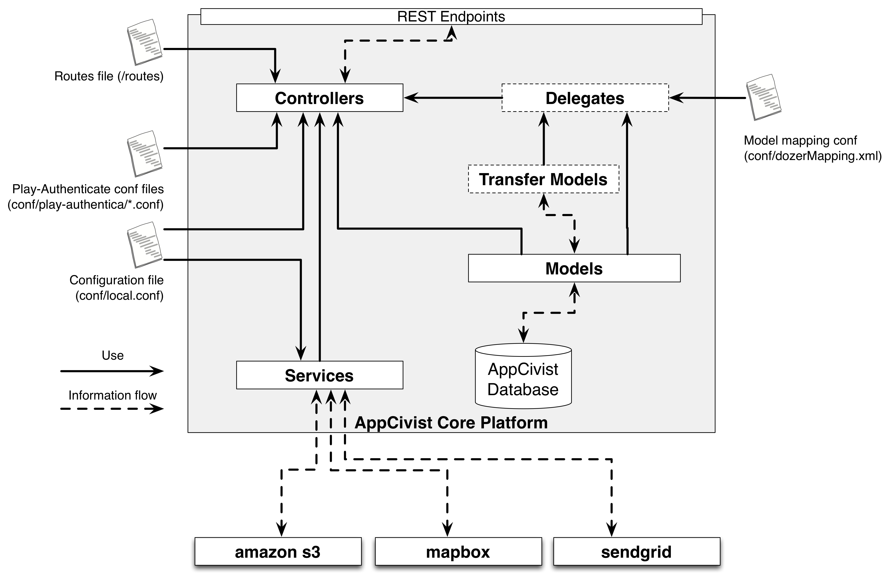
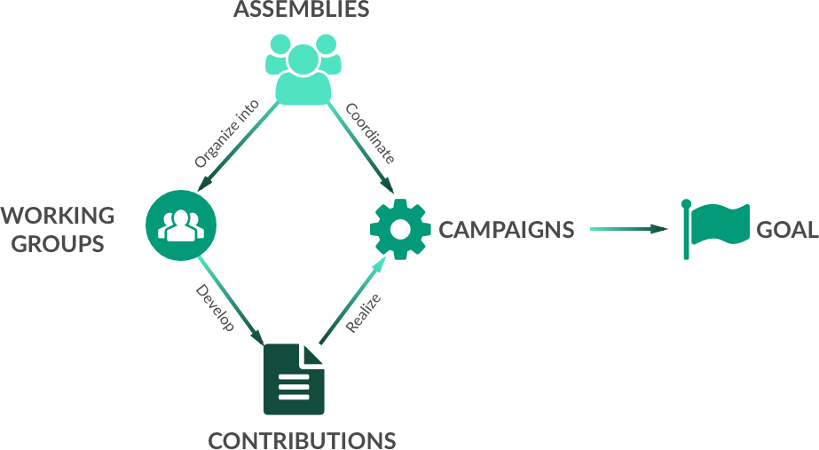
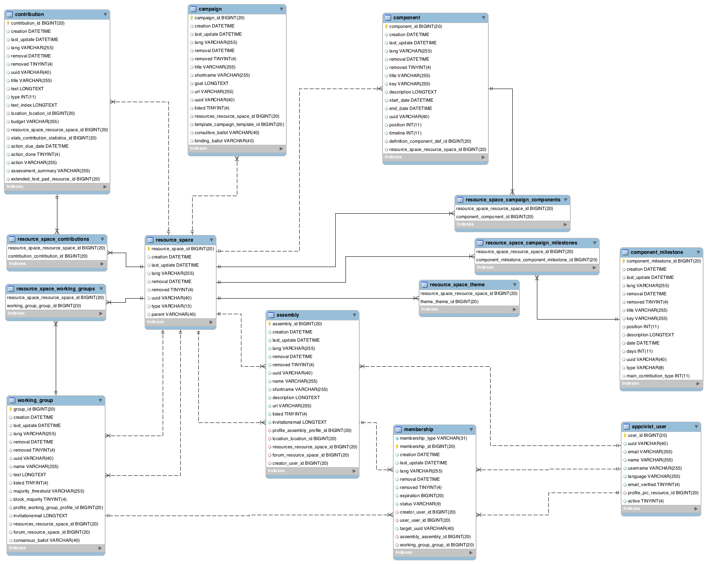

# AppCivist Core Platform Architecture

AppCivist Core's platform is implemented as a REST API built with [playframework](https://www.playframework.com), [play-authenticate](https://github.com/joscha/play-authenticate) (for user authentication) and [deadbolt](http://deadbolt.ws/) (for user authorization). This document describes how the source code is organized for developers to contribute and extend or improve our codebase. 

## Summary

For each RESTful endpoint (e.g., GET /assembly), a line in the **Routes file** (conf/routes) indicates which **Controller** (controllers/\*) will be used to answer a request that matches that route, including the specific method in that controller (e.g., *controlers.Contributions.findAssemblyContributions*).  Controllers then operate on **Model** objects that represent entities in the database and contain the logic to access the data. 

The outcome of each operation is then rendered in JSON to provide the resulting **View** (which can also be, in some cases, generated through play's templating framework - views/\*). Playframework provides response helpers as part of the **Results** class (*play.mvc.Results*). These helpers can be used to generate the response to requests with the appropriate HTTP data on them (Results.ok(..) for HTTP 200, Results.notFound(..) for HTTP 404, etc.). These helpers receive the data to return in the body as a parameter. Playframework also provides helper Json functions (*play.libs.Json*) to convert an object to json (e.g., *Json.toJson(object)*) and viceversa (e.g., *Json.fromJson(object)*).  

In some cases, as a way of reducing the complexity and amount of code in controllers, an extra layer of abstraction was introduced through **Delegate** classes, which simply implement part of the logic that the controller needs. Similarly, to reduce the complexity of the object we will render as a view in JSON, **Transference Models** are objects that map the model but contain no data access logic, they simply serve as the means of specifying the desired outcome of an operation. When they are used, [dozer](dozer.sourceforge.net/documentation/gettingstarted.html) is used to map the model to transference models and viceversa. 

In addition to this general organization, authentication and authorization are provided through [play-authenticate](https://github.com/joscha/play-authenticate) and [deadbolt](http://deadbolt.ws/). The **Users** controller implements most of the play-authenticate methods for user/password authentication (the only supported right now). Authenticated users receive an **Auth Token** that must be included as the header **PLAY_SESSION** on every request. Annotations like **@SubjectPresent** (which only checks that there is an authenticated user associated to the request) and **@Dynamic** (which redirects to a specific class and method in the **security** package) are used to enforce authorization logics (based on user roles for example). To use these annotations, they are placed on top of controller methods. 

**@Api\*** annotations are used to generate API documentation through swagger. 

## AppCivist Resources: simplified data model and database schema
In a nutshell, the AppCivist core platform provides an API to manage **Assemblies** of people to coordinate **Campaigns** in which they organize into **Working Groups** to develop **Contributions** (ideas, issues and full proposals) in order to make decisions democratically. 

From this simple data model, the following picture represents the simplified data schema. To provide maximum flexibility for future API developments and use cases, we use the **Resource Space** pattern to allow the main entities to be fully connected to each other. In this way, an **Assembly** can contain multiple **Campaigns**, **Working Groups** and **Contributions**, but we can also allow **Campaigns** to contain **Working Groups** and **Contributions**. The API definition will define which connections are allowed and what their specific semantic is.  

The package **models** contain a one-to-one mapping of this database schema to java classes. Each java model in this package represents a **persistent** entity and contains the queries to access the database. **[JPA annotations](http://www.oracle.com/technetwork/middleware/ias/toplink-jpa-annotations-096251.html)** are used to map properties and relationships among entities. **[Java Ebean](http://ebean-orm.github.io/docs/)** is the ORM engine that connects java classes to the actual database, allowing us to construct queries and program the persistency logic directly in java.  

## API resources and controllers

AppCivist controllers encapsulate functionalities and logic related to the resources: 

1. **Assemblies:** management operations for listing, reading, creating, configuring, updating and deleting assemblies. Writing operations in this controller are only be available to users who have the role **COORDINATOR** in their membership to the assembly.  
2. **Working Groups:** management operations for listing, reading, creating, configuring, updating and deleting working groups. Writing operations in this controller are only be available to users who have the role **COORDINATOR** in their membership to the working group.  
3. **Campaigns:** management operations for listing, reading, creating, configuring, updating and deleting campaigns. Writing operations in this controller are only be available to users who have the role **COORDINATOR** in their membership to the assembly that owns the campaign.  
4. **Contributions:** management operations for listing, reading, creating, configuring, updating and deleting contributions of all types (ideas, issues, notes, proposals, comments, discussions). Writing operations in this controller should only be available to users who have the role **MEMBER** in their membership to the assembly, working group or campaign to which the contribution belongs. For proposals, editing is available to **MEMBERS** of the authoring working group, while deleting is only available to **COORDINATORS** of the authoring working group. 
5. **Users:** contains all the authentication operations. Some operations in this controller are not available through the API but are executed before all the authenticated operations. 
6. **Memberships:** management operations for listing, reading, creating, updating and deleting memberships connecting users to either assemblies or working groups. Writing operations in this controller should only be available to users who have the role **COORDINATOR** in their membership to the assembly or working group for which the membership is created. **MEMBERS** can delete their membership records.  
7. **Files:** a proxy controller that allow any appcivist user to upload a file to Amazon S3 and obtain its URL. This can then be added to contributions as an attachment.  

### API Docs
The detail of each API operation is documented within the code through **[Swagger Api Annotations](https://github.com/swagger-api/swagger-core/wiki/Annotations-1.5.X)**. A generated documentation is available in this link: **[API Docs for the AppCivist Core Platform](http://appcivist.littlemacondo.com/backend/api/doc)**

Similalry, the Voting API is also annotated using [ApiPie for RAILS](https://github.com/Apipie/apipie-rails). The generated web documentation is available at this link: **[API Docs for the AppCivist Voting API](http://appcivist.littlemacondo.com/voting/docs/api/v0.html)**. 

The Voting API source code is maintained in [a different repository](https://github.com/socialappslab/appcivist-voting-api) and accesses the same database in the current implementation. This will change in the future to have all voting operations also in this core platform. 

### Authentication &  Authorization
Authentication is implemented by extending the [play-authenticate](http://joscha.github.io/play-authenticate/#showcase) module. Authorization is implemented by extending the [deadbolt](http://deadbolt.ws/) module. Both modules provide **Java annotations** that can be used on top of each controller operation to execute authentication and authorization operations before the execution of the operation. Below are some annotations we use and how they are implemented. 

* **@SubjectPresent:** only execute the operation if there is an authenticated user in the request (i.e., the request contains a PLAY_SESSION header with a valid token).
* **@Restrict({@Group(GlobalData.USER\_ROLE)}):** verify that the user requesting this operation has the role defined by **GlobalData.USER\_ROLE**. 
* **@Dynamic(value = "MemberOfAssembly", meta = SecurityModelConstants.ASSEMBLY\_RESOURCE_PATH):** execute the customized authorization operations contained in the Dynamic Resource Handler named **MemberOfAssembly** (see **[security.MyDynamicResourceHandler](../app/security/MyDynamicResourceHandler.java)**) to find the implementation of each of these custom authorization handlers). Custom authorization handlers are used to implement the logic behind the control of roles in each assembly and working group. 

Configuration files in the [conf/play-authenticate](../conf/play-authenticate) folder configure both these modules. To extend authentication to use other providers (e.g., google, facebook, twitter), use these configuration and follow the documentation related to each module in their websites.  

## Services in use

### Etherpad
The current prototype supports the connection to an Etherpad instance for storing the extended body of full proposals. The logic to connect to Etherpad can be found when Contributions of the type PROPOSAL are created (see the **[Contributions Controller](../app/controllers/Contributions.java)** and the [Contributions Delegate](../app/delegates/ContributionsDelegate.java))

Details about the Etherpad API can be found in the official [Etherpad HTTP API Docs](https://github.com/ether/etherpad-lite/wiki/HTTP-API). 

For the platform to work, the [configuration file](../conf/local.sample.conf) must include the etherpad api key and base url of the instance to use (see the etherpad section in the conf file and contact the main developers for the information related our [testing etherpad instance](http://etherpad.littlemacondo.com/)).

### Amazon S3 connection
In the current implementation, files uploaded through the AppCivist-PB UI are stored in Amazon S3. In order for the platform to work the [configuration file](../conf/local.sample.conf) must include the AWS credentials in the aws section. You can get limited free storage using the [AWS free tier](https://aws.amazon.com/free/?sc_channel=PS&sc_campaign=acquisition_US&sc_publisher=google&sc_medium=cloud_computing_b&sc_content=aws_free_e_control_q32016&sc_detail=aws%20free%20tier&sc_category=cloud_computing&sc_segment=102882724602&sc_matchtype=e&sc_country=US&s_kwcid=AL!4422!3!102882724602!e!!g!!aws%20free%20tier&ef_id=V7etgQAAAGl5exIA:20160823183935:s).

### Sendgrid API
Email invitations are sent using the [Sendgrid API](https://sendgrid.com/docs/API_Reference/index.html). Credentials for Sendgrid are configured in the [smtp configuration file](../conf/play-authenticate/smtp.conf.sample).  

### MapBox API
A preliminary connection to the [MapBox API](https://www.mapbox.com/api-documentation/) is used when we create assemblies and working groups with a location. The MapBox API is called to obtain the geographic coordinates related to the location string, which is stored in the database in GeoJSON format. MapBox API credentials must be configured in the mapboxapi section of the [configuration file](../conf/local.sample.conf).

## Development Guide HowTo
TODO

