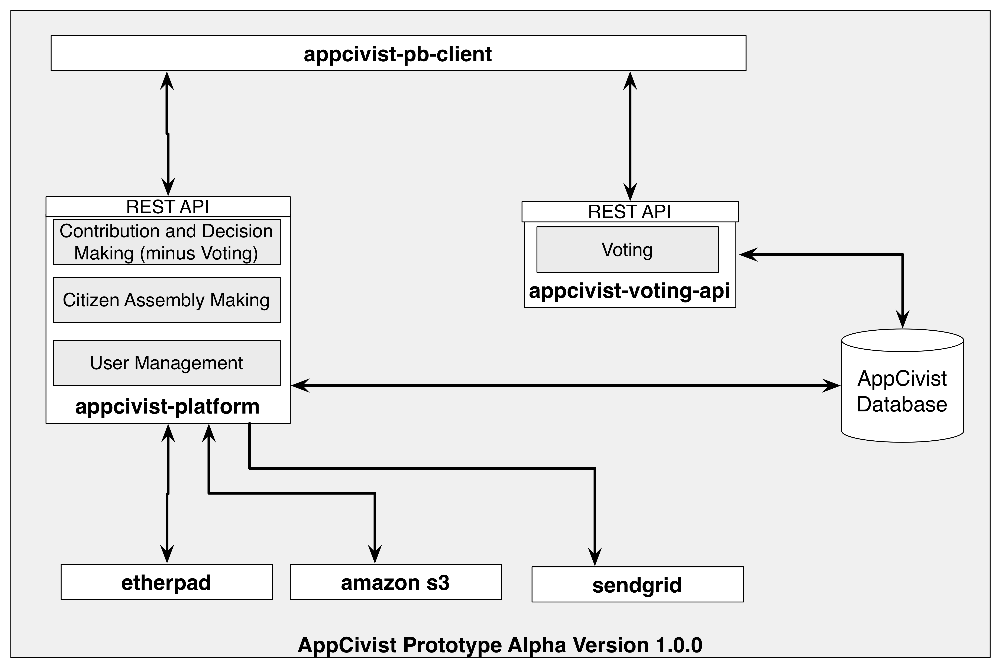

# Getting started with AppCivist Core Platform

Installing **AppCivist** in your server entails installing each of the following components, as shown in the image below. This guide explains how to download and install the AppCivist Core Platform and the AppCivist database.  
  

The AppCivist Core Platform provides a RESTful API implemented with the full-stack [Playframework][1]. Follow these instructions to download the source code and run it. 

1. You can either use the **activator** binary in the root folder of the repository or download and install [Typesafe Activator][3] (make sure to add the folder where you uncompress activator to your PATH)
2. Clone this repository
3. Create the database using the script **sql/database-create-postgres.sql** (for PostgreSQL databases, which is used in the sample configuration file) or **sql/database-create-mysql.sql** (for MySQL databases)
3. Make a copy of **conf/local.conf.sample** into **conf/local.conf** and into **conf/local.test.conf**. Make sure test configurations point to a test database you own. 
4. Copy **conf/play-authentica/deadbolt.conf.sample** to **conf/play-authentica/local.deadbolt.conf**
5. Copy **conf/play-authentica/mine.conf.sample** to **conf/play-authentica/mine.local.conf** and replace email address with and email address you own 
6. Copy **conf/play-authentica/smtp.conf.sample** to **conf/play-authentica/smpt.local.conf** and replace email and passwords with your own. 
6. Replace the configuration values that start with "${?*" by the required credentials for IMGUR, Amazon S3 and MapBox API. 
7. Make sure you never commit the files in previous steps into the repository.
8. On a console, access your local copy of appcivist-core source code: **cd <PATH_TO_YOUR_LOCAL_REPO>/appcivist-platform**
9. Run the command **activator** to enter the typsafe activator console (or if you want to enable debugging from your IDE, use **activator -jvm-debug 9999 -D**). It will automatically download all the dependencies and setup the [play framework][1].  
10. **OPTIONAL**. Follow Play Framework's [Get Started][2] guide to learn more about how the project is organized
11. Run the server using the following command **run -Dconfig.resource=local.conf -Dlogger.file=conf/local.logback.xml**
12. On your browser, go to **http://localhost:9000/api/doc** to visit the documentation of the API endpoints and have try them out with real examples. 

The server is configured to automatically use an in-memory H2 database. You can install postgresql or mysql and use them if you wish. All you need to do is install those servers, create a database and then replace the driver, database name, username and password you use with the database. 

## Package 

This file will be packaged with your application, when using `activator dist`.

## Other getting started guides
1. [Getting Started with AppCivist-PB web front-end](https://github.com/socialappslab/appcivist-pb-client)
2. [Getting Started with the AppCivist Voting API](https://github.com/socialappslab/appcivist-voting-api)
3. [Set Up Etherpad-Lite](https://github.com/ether/etherpad-lite/wiki#set-up)

[1]: https://www.playframework.com/
[2]: https://www.playframework.com/documentation/2.3.x/Home
[3]: http://typesafe.com/get-started
[4]: https://www.getpostman.com/
